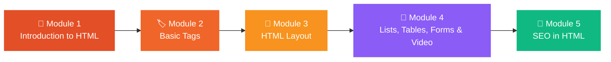

<div align="center">


# 🌐 HTML FOR BEGINNERS

**Learn the foundation of every website — one module at a time.**


<br />


<br />

[📖 About](#-about) &nbsp;•&nbsp; [🧩 Modules](#-modules) &nbsp;•&nbsp; [🛠️ Project](#-practice-project) &nbsp;•&nbsp; [🚀 Get Started](#-getting-started) &nbsp;•&nbsp; [📁 Structure](#-project-structure) &nbsp;•&nbsp; [📚 Resources](#-resources) &nbsp;•&nbsp; [🤝 Contribute](#-contributing)

</div>

## 📖 About

**HTML FOR BEGINNERS** is a hands-on learning repository for anyone taking their first steps into web development. Each module breaks HTML into small, easy-to-follow ideas, with code you can open, edit, and run right in your browser — no prior coding experience needed.

| 🎯 Who it's for | 📦 What you'll find | 🧭 How to learn |
| :--- | :--- | :--- |
| Absolute beginners, students, and self-learners | Simple explanations with runnable code examples | Go module by module and practice as you go |

> [!TIP]
> **HTML → Structure 🏗️ &nbsp;·&nbsp; CSS → Style 🎨 &nbsp;·&nbsp; JavaScript → Behavior ⚡**
>
> Every web developer starts with HTML. Learn the structure first, then make it beautiful with CSS and interactive with JavaScript.

## 🧩 Modules

Follow the modules in order — each one builds on the last.



### 📘 Module 1 · Introduction to HTML

> *Start here — understand what HTML is and how a webpage is built.*

- 🌐 What HTML is and what it's used for
- ✨ The key features of HTML
- 🧱 The HTML boilerplate — `<!DOCTYPE html>`, `<head>`, and `<body>` explained
- 🎨 How **HTML + CSS + JavaScript** work together
- 📂 A basic project structure with `index.html`, `style.css`, and `script.js`

[](https://github.com/vinayakmishra4/HTML-FOR-BEGINEERS/blob/main/Introdution-to-html/Readme.md)

### 🏷️ Module 2 · Basic Tags

> *Meet the everyday tags you'll use on almost every webpage.*

- 🔠 Headings and paragraphs
- 📝 Text formatting
- 🔗 Links and 🖼️ images

[](https://github.com/vinayakmishra4/HTML-FOR-BEGINEERS/tree/main/Basic-tag)

### 🧱 Module 3 · HTML Layout

> *Learn how to organize a page into clear, meaningful sections.*

- 📑 Semantic layout elements — `<header>`, `<nav>`, `<main>`, `<section>`, `<article>`, `<aside>`, and `<footer>`
- 📐 Structuring a full page from top to bottom

[](https://github.com/vinayakmishra4/HTML-FOR-BEGINEERS/tree/main/Html-layout)

### 📝 Module 4 · Lists, Tables, Forms & Video

> *Four everyday building blocks — organize content, show data, collect input, and embed media.*

- 📝 Lists — ordered, unordered, and definition lists
- 📊 Tables — a styled students table with caption, header, and body
- 🧾 Forms — a full registration form with ten different input controls
- 🎬 Video — embedding and controlling a local video with `<video>`

[](https://github.com/vinayakmishra4/HTML-FOR-BEGINEERS/tree/main/list-forms-table)

### 🚀 Module 5 · SEO in HTML

> *The final module — learn how good HTML helps a website actually get found.*

- 🔍 What SEO is, and why `<title>`, `<meta>`, headings, and `<alt>` text matter
- 🧩 The main types of SEO — On-Page, Technical, Off-Page, Local, Content, Mobile, and more
- 🏗️ The semantic HTML elements search engines look for, from `<nav>` to `<article>`
- 🟢 White Hat vs 🔴 Black Hat techniques, and why sustainable SEO wins long-term
- 🧠 A quick-revision cheat sheet tying HTML structure back to search rankings

[](https://github.com/vinayakmishra4/HTML-FOR-BEGINEERS/tree/main/SEO)

> 🎉 **That's the full roadmap — Introduction → Basic Tags → Layout → Lists/Tables/Forms/Video → SEO.** Star the repo if it helped you learn!

## 🛠️ Practice Project

Once you've worked through the modules, here's the skills put into a real build.

### 🍽️ Zomato Clone

> *A front-end clone of the Zomato food-delivery website, built with HTML, CSS, and JavaScript.*

- 🏗️ Full page structure built from scratch with HTML
- 🎨 Styled with custom CSS
- ⚡ Interactivity added with JavaScript
- 🖼️ Real image assets for a polished, realistic look

[](https://github.com/vinayakmishra4/ZOMATO-CLONE) [](https://github.com/vinayakmishra4/ZOMATO-CLONE/blob/main/LICENSE)

## 🚀 Getting Started

**What you need**

- 💻 A code editor — [VS Code](https://code.visualstudio.com/) is a great choice
- 🌍 A web browser — Chrome, Firefox, or Edge
- 🙌 That's it — no installation and no prior experience needed

**Run it on your computer**

```bash
# 1. Clone the repository
git clone https://github.com/vinayakmishra4/HTML-FOR-BEGINEERS.git

# 2. Move into the project folder
cd HTML-FOR-BEGINEERS
```

Then open `index.html` (or any `.html` file) in your browser, edit the code in your editor, and refresh the page to see your changes live.

**Your first webpage**

```html
<!DOCTYPE html>
<html lang="en">
<head>
    <meta charset="UTF-8">
    <title>My First Page</title>
</head>
<body>
    <h1>Hello, World!</h1>
    <p>This is my first HTML page.</p>
</body>
</html>
```

## 📁 Project Structure

```
HTML-FOR-BEGINEERS/
├── Introdution-to-html/          # Module 1 · Introduction to HTML
├── Basic-tag/                    # Module 2 · Basic Tags
├── Html-layout/                  # Module 3 · HTML Layout
├── list-forms-table/             # Module 4 · Lists, Tables, Forms & Video
├── SEO/                          # Module 5 · SEO in HTML
├── index.html                    # Home page
├── top-view-blue-decorative-frame.jpg
└── README.md                     # You are here 📍
```

## 📚 Resources

| Resource | Good for |
| :--- | :--- |
| [MDN Web Docs — HTML](https://developer.mozilla.org/en-US/docs/Web/HTML) | The most trusted, up-to-date HTML reference |
| [W3Schools — HTML Tutorial](https://www.w3schools.com/html/) | Beginner-friendly tutorials with a try-it editor |

## 🤝 Contributing

Found a typo, or have an idea to make a module clearer? Contributions are welcome!

1. 🍴 **Fork** the repository
2. 🌿 Create a branch — `git checkout -b improve-module`
3. 💾 Commit your changes — `git commit -m "Improve module"`
4. 🚀 Push your branch and open a **Pull Request**

<div align="center">

**Made with ❤️ by [Vinayak Mishra](https://github.com/vinayakmishra4)**

⭐ If this repo helped you, give it a star — it means a lot! ⭐


</div>